# E2E Test Catalogue

All tests run against real Docker containers (ibc-go-simd v8.5.2 + Hermes relayer).
The binary under test is provided via `POUR_BIN` or `POUR_VERSION`.

---

## Infrastructure legend

| Component          | Role                                                                                     |
|--------------------|------------------------------------------------------------------------------------------|
| **hub-1**          | IBC source-only chain — chain ID `hub-1`, denom `stake`, bech32 `cosmos`; no native drip |
| **mynet-1**        | operator's chain — chain ID `mynet-1`, denom `uosmo`, bech32 `cosmos`                    |
| **Mock registry**  | httptest server serving `chain.json` + `_IBC/*.json`                                     |
| **Hermes relayer** | relays IBC packets between hub-1 and mynet-1                                             |
| **pour**           | binary under test; config written to a temp dir before each test                         |

The `pour-faucet` account (`TestMnemonic` at index 0) is seeded in genesis on every
chain that starts. mynet-1 genesis includes both `stake` and `uosmo` for that account.

---

## IBC discovery

### TestIBCDiscovery

**What it tests:** pour fetches IBC channel data from the chain registry, exposes it
correctly in the API, and surfaces the `ibc_drips` config for IBC-only destination chains.

**Infrastructure:** hub-1 + mock registry (mynet-1 placeholder only, not running).

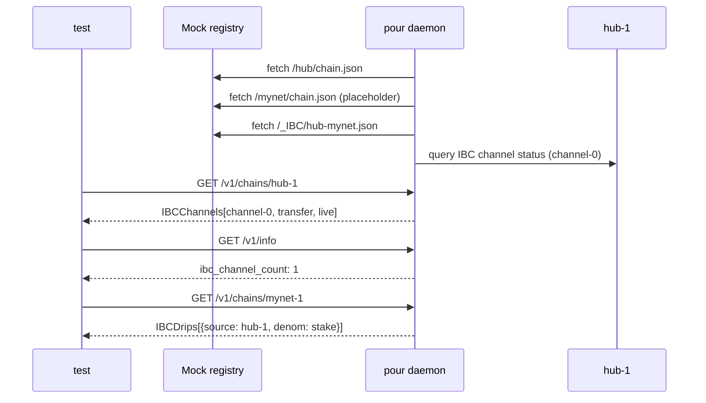

**Assertions:**

- `GET /v1/chains/hub-1` returns exactly one IBC channel (`channel-0`, port `transfer`, peer `mynet`, status `live`,
  preferred)
- `GET /v1/info` returns `ibc_channel_count: 1`
- `GET /v1/chains/mynet-1` returns one IBC drip entry with `source_chain_id: hub-1`, `denom: stake`

---

## Auto mode

### TestAutoMode_HappyPath

**What it tests:** `pour serve --auto` parses genesis from a bind-mounted home dir,
self-funds the faucet address using the fund mnemonic, and serves a native drip.

**Infrastructure:** mynet-1 only (no registry).

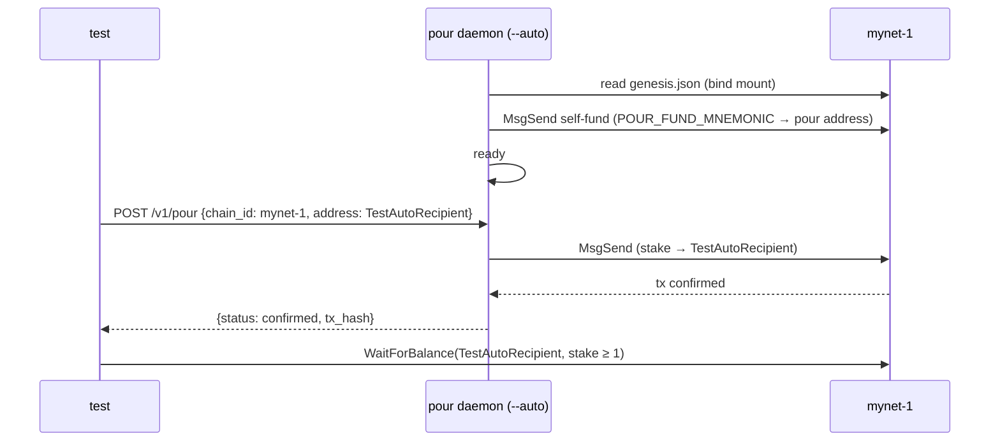

**Assertions:**

- Response `status == "confirmed"`, `tx_hash` non-empty
- `TestAutoRecipient` balance ≥ 1 stake on mynet-1

---

### TestAutoMode_WaitForFunding

**What it tests:** when no fund mnemonic is provided, pour polls until an external actor
funds its address, then begins serving requests.

**Infrastructure:** mynet-1 only. Pour address is derived from `RelayerMnemonic` (not
seeded in genesis).

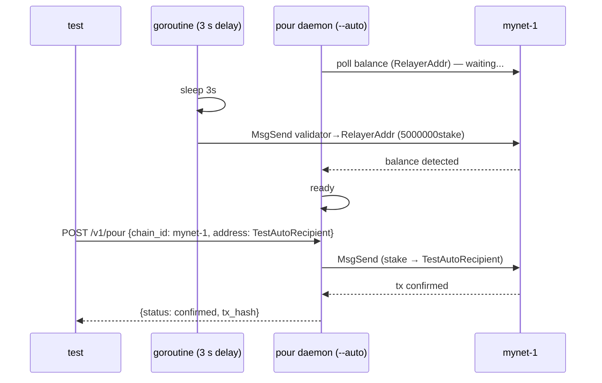

**Assertions:**

- `StartPourAuto` returns only after pour has detected its balance and is healthy
- Response `status == "confirmed"`, `tx_hash` non-empty

---

### TestAutoMode_HotReload

**What it tests:** pour detects a devnet chain reset (block height regression),
reconnects the gRPC client, and resumes serving drips without operator intervention.

**Infrastructure:** mynet-1 in restartable mode (simd loops; `ResetChain` kills simd
and waits for it to restart from block 1).

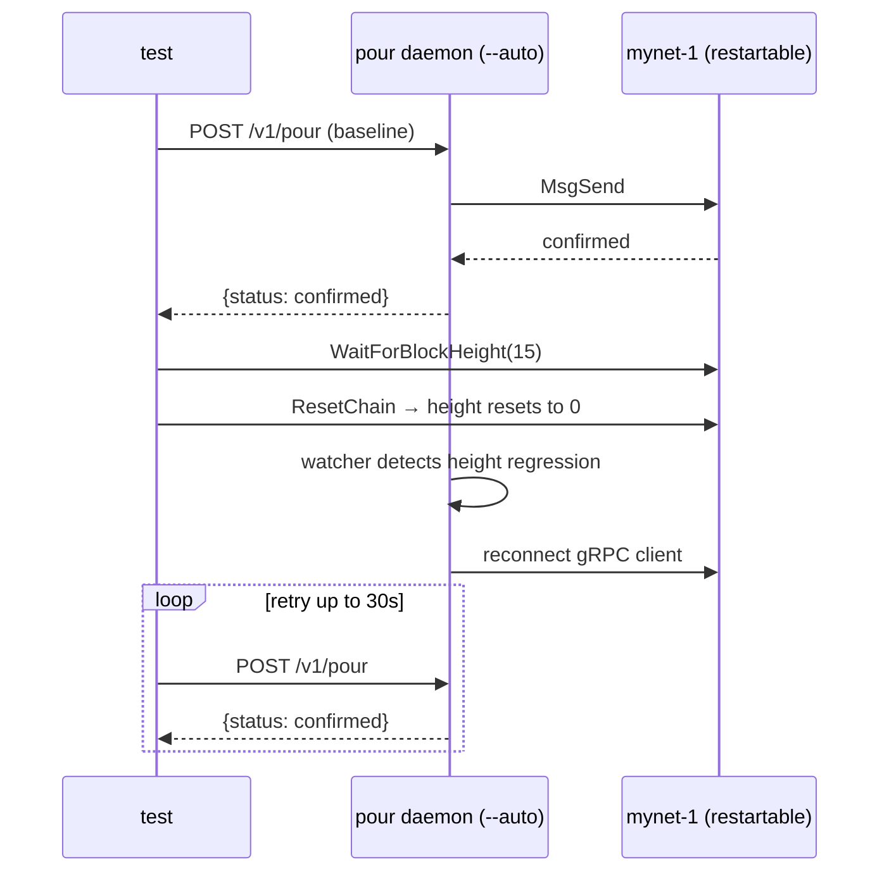

**Assertions:**

- Baseline drip before reset: `status == "confirmed"`
- After reset: at least one drip succeeds within 30 s with `status == "confirmed"`

---

### TestAutoMode_GRPCToRESTFailover

**What it tests:** pour automatically switches from gRPC to REST when the active gRPC
endpoint goes down mid-session.

**Infrastructure:** mynet-1 + a local TCP proxy in front of its gRPC port.

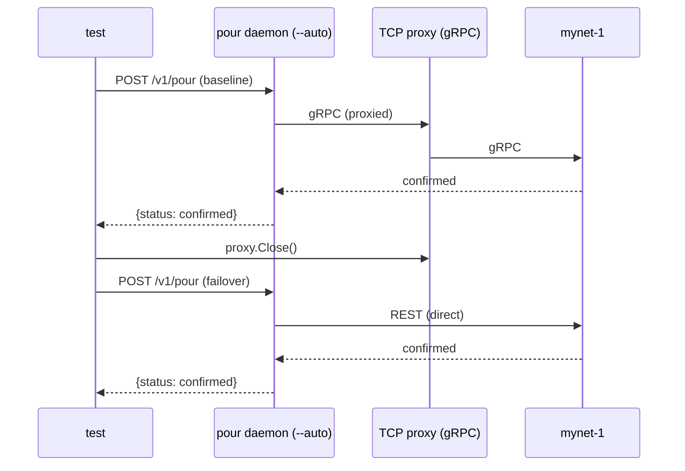

**Assertions:**

- Baseline drip (gRPC path): `status == "confirmed"`
- Post-failover drip (REST path): `status == "confirmed"`

---

### TestAutoMode_RESTOnly

**What it tests:** pour works end-to-end with only a REST/LCD endpoint — no gRPC
configured. All wire operations use REST.

**Infrastructure:** mynet-1 only; `--grpc ""` omits gRPC from the auto config.

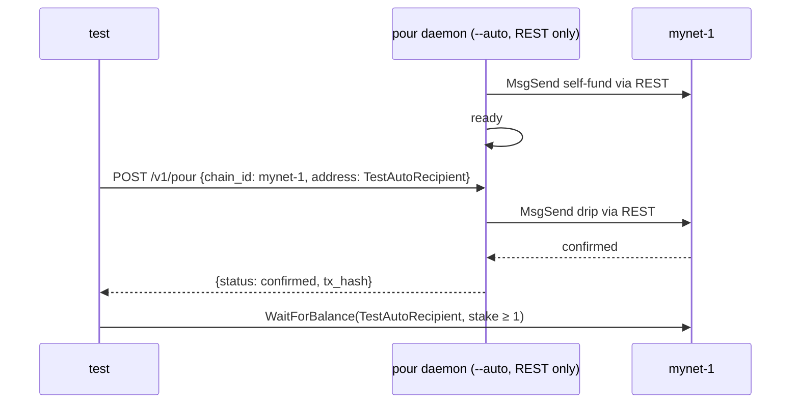

**Assertions:**

- Response `status == "confirmed"`, `tx_hash` non-empty
- `TestAutoRecipient` balance ≥ 1 stake on mynet-1

---

## IBC transfers

### TestIBCTransfer_HappyPath

**What it tests:** full IBC drip path — a request with `denom=stake` on mynet-1 causes
pour to send `MsgTransfer` from hub-1; the recipient on mynet-1 receives the IBC voucher.

**Infrastructure:** hub-1 + mynet-1 + Hermes relayer + mock registry.
mynet-1 is IBC-only (no native wallet).

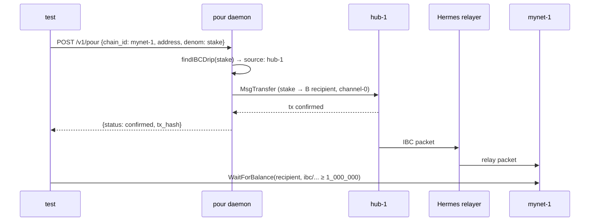

**Assertions:**

- Response `status == "confirmed"`, `tx_hash` non-empty
- mynet-1 recipient holds ≥ 1,000,000 of `ibc/SHA256(transfer/channel-0/stake)`

---

### TestIBCTransfer_NativeOnDestination

**What it tests:** a chain configured with both native and IBC drips issues a native
`MsgSend` from its own wallet when no denom is specified.

**Infrastructure:** hub-1 + mynet-1 + mock registry. No relayer needed.
mynet-1 has `DualDripDestination: true` (native drip + IBC drip, `batch_window: "0s"`).
hub-1 is startup-only — pour connects to it but no test messages flow through it.

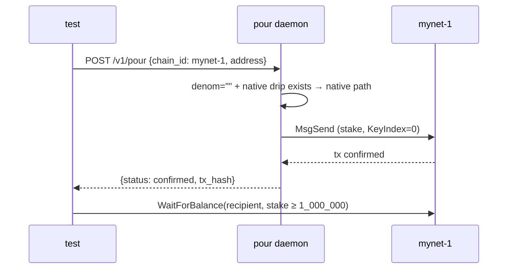

**Assertions:**

- Response `status == "confirmed"`, `tx_hash` non-empty
- mynet-1 recipient holds ≥ 1,000,000 native `stake` (not an IBC voucher)

---

### TestIBCTransfer_NativeAndIBC

**What it tests:** both native and IBC drip paths work independently on the same
destination chain within the same pour session.

**Infrastructure:** hub-1 + mynet-1 + Hermes relayer + mock registry.
mynet-1 has `DualDripDestination: true`.

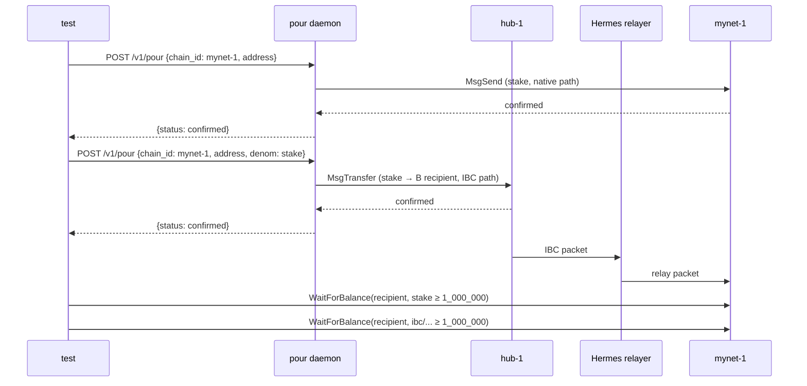

**Assertions:**

- Native pour: `status == "confirmed"`, `tx_hash` non-empty
- IBC pour: `status == "confirmed"`, `tx_hash` non-empty
- mynet-1 recipient holds ≥ 1,000,000 native `stake`
- mynet-1 recipient holds ≥ 1,000,000 `ibc/SHA256(transfer/channel-0/stake)`

---

### TestIBCTransfer_SourceChainRejectsDirect

**What it tests:** hub-1, configured as an IBC source-only chain (no `drip.anonymous`, no
`ibc.drips`), rejects direct pour requests with HTTP 400 — both the native drip path (no
denom) and any denom request. hub-1 must not be usable as a public faucet.

**Infrastructure:** hub-1 + mock registry (mynet-1 placeholder only, not running).

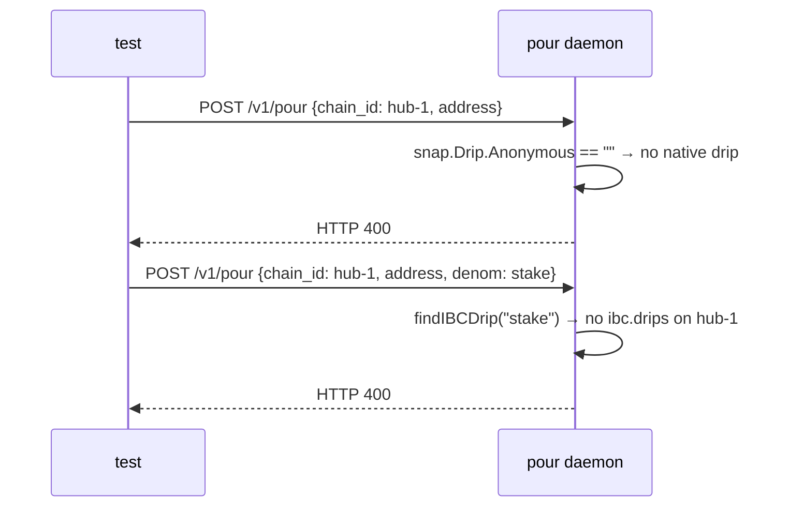

**Assertions:**

- Native pour to hub-1: HTTP `400`
- IBC-denom pour to hub-1 with `denom: stake`: HTTP `400`
- No transaction broadcast on any chain

---

### TestIBCTransfer_UnknownDenom

**What it tests:** requesting a denom that has no matching IBC drip config returns
HTTP 400 without broadcasting any transaction.

**Infrastructure:** mock registry + hub-1 (startup-only — pour requires a live endpoint to become healthy; no
transactions are sent to it).
mynet-1 is IBC-only with a single `stake` drip configured; it is not running.

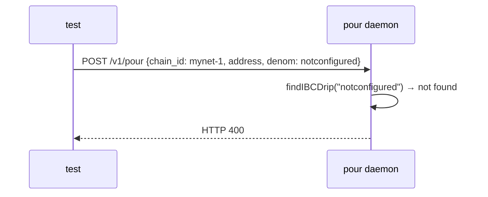

**Assertions:**

- HTTP response status `400`
- No transaction broadcast on any chain